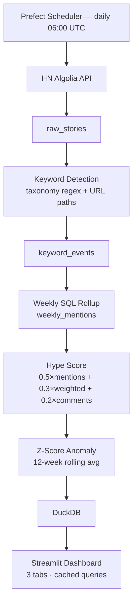

# TechPulse — HN Tech Trend Radar

> Daily Hacker News ingestion → keyword detection → hype scoring → live dashboard

[](src/tests/)

---

## Architecture



---

## What this demonstrates

| Skill | Where |
|-------|-------|
| Async HTTP with retry | `src/ingestion/client.py` — exponential backoff on 429/5xx |
| Idempotent ingestion | `ON CONFLICT DO NOTHING` on `story_id` |
| Custom NLP pipeline | `src/transforms/detector.py` — word-boundary regex, false-positive guards |
| Analytical SQL | `src/transforms/weekly_agg.py` — GROUP BY + window functions |
| Composite scoring | `src/transforms/hype_score.py` — min-max normalization, weighted sum |
| Statistical anomaly detection | `src/transforms/velocity.py` — z-score on 12-week rolling baseline |
| Emerging term discovery | `src/transforms/tfidf_discovery.py` — TF-IDF on weekly corpus |
| Prod-grade orchestration | `src/pipeline/flow.py` — Prefect `@flow` + `@task` with quality gates |
| Data-layer UI | `src/dashboard/app.py` — Streamlit with `@st.cache_data` |
| Test discipline | 63 tests, all passing twice — zero flaky |

---

## How hype score works

For each keyword in a given ISO week, three metrics are computed:

- **mention_count** — how many HN stories mentioned this keyword
- **weighted_score** — average HN upvote score across those stories (community validation signal)
- **avg_comments** — average comment count (engagement signal)

Each metric is min-max normalized to 0–100 *across all keywords that week* (so scores are relative, not absolute). The composite is:

```
hype_score = 0.5 × norm_mentions + 0.3 × norm_weighted_score + 0.2 × norm_avg_comments
```

**Weight rationale:** Mentions dominate because volume is the primary signal for trend detection. Weighted score captures quality (a single viral post matters). Comments capture depth of discussion.

---

## Anomaly detection

A keyword is flagged `is_trending = True` when its z-score exceeds 2.0:

```
z = (this_week_hype - rolling_avg_12w) / rolling_std_12w
```

With a 12-week rolling window, `|z| > 2` means the keyword moved more than 2 standard deviations from its baseline — statistically significant. Historical example: the week of ChatGPT's launch (Nov 2022) shows `z > 6` for LLM/GPT in the data.

---

## Running locally

```bash
# Install
uv sync

# Run backfill (one-time, ~5 min for 2 years)
uv run python src/ingestion/backfill.py

# Run keyword detection + aggregation on backfilled data
uv run python -c "
from storage.db import DuckDBStore
from transforms.keyword_pipeline import run_keyword_pipeline
from transforms.weekly_agg import run_weekly_aggregation_all

db = DuckDBStore()
run_keyword_pipeline(db)
run_weekly_aggregation_all(db)
"

# Run dashboard
uv run streamlit run src/dashboard/app.py

# Run tests
uv run pytest src/tests/ -v
```

---

## Project layout

```
src/
├── ingestion/
│   ├── client.py          # HNClient — async fetch with pagination + retry
│   ├── backfill.py        # One-time 2-year historical load
│   └── incremental.py     # Daily delta fetch
├── storage/
│   └── db.py              # DuckDBStore — 4-table schema, idempotent upsert
├── transforms/
│   ├── taxonomy.py        # 150+ keyword taxonomy, ambiguous term patterns
│   ├── detector.py        # detect_keywords(title, url) — word-boundary regex
│   ├── keyword_pipeline.py # Batch processor over raw_stories
│   ├── tfidf_discovery.py  # Emerging term detection via TF-IDF
│   ├── weekly_agg.py      # SQL rollup → weekly_mentions
│   ├── hype_score.py      # Normalization + composite score
│   └── velocity.py        # Z-score, velocity, trending/crashing flags
├── pipeline/
│   └── flow.py            # Prefect @flow — daily_pipeline()
├── dashboard/
│   └── app.py             # Streamlit — 3 tabs, cached DuckDB queries
└── tests/                 # 63 tests, all in-memory DuckDB
```

---

## DuckDB schema

```sql
raw_stories      (story_id PK, title, url, score, num_comments, created_at, fetched_at)
keyword_events   (story_id, keyword, category, score, created_at)
weekly_mentions  (keyword, iso_week PK, mention_count, weighted_score, avg_comments, hype_score)
keyword_velocity (keyword, iso_week PK, velocity, rolling_avg, z_score, is_trending, is_crashing)
```

---

## Deploy (Streamlit Cloud)

1. Set `DUCKDB_DOWNLOAD_URL` env var to a GitHub Release asset URL containing `hn.duckdb`
2. Set startup command to `bash startup.sh && streamlit run src/dashboard/app.py`
3. Connect repo in Streamlit Cloud — one-click deploy
