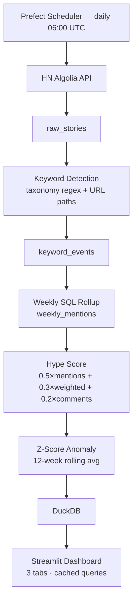

# TechPulse — HN Tech Trend Radar

> Daily Hacker News ingestion → keyword detection → hype scoring → live dashboard

[](src/tests/)

---

## Architecture



---

## What this demonstrates

| Skill | Where |
|-------|-------|
| Async HTTP with retry | `src/ingestion/client.py` — exponential backoff on 429/5xx |
| Idempotent ingestion | `ON CONFLICT DO NOTHING` on `story_id` |
| Custom NLP pipeline | `src/transforms/detector.py` — word-boundary regex, false-positive guards |
| Analytical SQL | `src/transforms/weekly_agg.py` — GROUP BY + window functions |
| Composite scoring | `src/transforms/hype_score.py` — min-max normalization, weighted sum |
| Statistical anomaly detection | `src/transforms/velocity.py` — z-score on 12-week rolling baseline |
| Emerging term discovery | `src/transforms/tfidf_discovery.py` — TF-IDF on weekly corpus |
| Prod-grade orchestration | `src/pipeline/flow.py` — Prefect `@flow` + `@task` with quality gates |
| Data-layer UI | `src/dashboard/app.py` — Streamlit with `@st.cache_data` |
| Test discipline | 63 tests, all passing twice — zero flaky |

---

## How hype score works

For each keyword in a given ISO week, three metrics are computed:

- **mention_count** — how many HN stories mentioned this keyword
- **weighted_score** — average HN upvote score across those stories (community validation signal)
- **avg_comments** — average comment count (engagement signal)

Each metric is min-max normalized to 0–100 *across all keywords that week* (so scores are relative, not absolute). The composite is:

```
hype_score = 0.5 × norm_mentions + 0.3 × norm_weighted_score + 0.2 × norm_avg_comments
```

**Weight rationale:** Mentions dominate because volume is the primary signal for trend detection. Weighted score captures quality (a single viral post matters). Comments capture depth of discussion.

---

## Anomaly detection

A keyword is flagged `is_trending = True` when its z-score exceeds 2.0:

```
z = (this_week_hype - rolling_avg_12w) / rolling_std_12w
```

With a 12-week rolling window, `|z| > 2` means the keyword moved more than 2 standard deviations from its baseline — statistically significant. Historical example: the week of ChatGPT's launch (Nov 2022) shows `z > 6` for LLM/GPT in the data.

---

## Running locally

```bash
# Install
uv sync

# Run backfill (one-time, ~5 min for 2 years)
uv run python src/ingestion/backfill.py

# Run keyword detection + aggregation on backfilled data
uv run python -c "
from storage.db import DuckDBStore
from transforms.keyword_pipeline import run_keyword_pipeline
from transforms.weekly_agg import run_weekly_aggregation_all

db = DuckDBStore()
run_keyword_pipeline(db)
run_weekly_aggregation_all(db)
"

# Run dashboard
uv run streamlit run src/dashboard/app.py

# Run tests
uv run pytest src/tests/ -v
```

---

## Project layout

```
src/
├── ingestion/
│   ├── client.py          # HNClient — async fetch with pagination + retry
│   ├── backfill.py        # One-time 2-year historical load
│   └── incremental.py     # Daily delta fetch
├── storage/
│   └── db.py              # DuckDBStore — 4-table schema, idempotent upsert
├── transforms/
│   ├── taxonomy.py        # 150+ keyword taxonomy, ambiguous term patterns
│   ├── detector.py        # detect_keywords(title, url) — word-boundary regex
│   ├── keyword_pipeline.py # Batch processor over raw_stories
│   ├── tfidf_discovery.py  # Emerging term detection via TF-IDF
│   ├── weekly_agg.py      # SQL rollup → weekly_mentions
│   ├── hype_score.py      # Normalization + composite score
│   └── velocity.py        # Z-score, velocity, trending/crashing flags
├── pipeline/
│   └── flow.py            # Prefect @flow — daily_pipeline()
├── dashboard/
│   └── app.py             # Streamlit — 3 tabs, cached DuckDB queries
└── tests/                 # 63 tests, all in-memory DuckDB
```

---

## DuckDB schema

```sql
raw_stories      (story_id PK, title, url, score, num_comments, created_at, fetched_at)
keyword_events   (story_id, keyword, category, score, created_at)
weekly_mentions  (keyword, iso_week PK, mention_count, weighted_score, avg_comments, hype_score)
keyword_velocity (keyword, iso_week PK, velocity, rolling_avg, z_score, is_trending, is_crashing)
```

---

## Deploy (Streamlit Cloud)

1. Set `DUCKDB_DOWNLOAD_URL` env var to a GitHub Release asset URL containing `hn.duckdb`
2. Set startup command to `bash startup.sh && streamlit run src/dashboard/app.py`
3. Connect repo in Streamlit Cloud — one-click deploy

---

## Known limitations

### Data coverage
- **Algolia 1000-hit cap.** Backfill uses 12h windows (~150–250 stories each). High-volume periods (major product launches, HN front-page surges) can still hit the cap and silently drop stories. The code warns but does not auto-subdivide the window to recover the missing slice.
- **Taxonomy is static.** The 150+ keyword list in `taxonomy.py` requires a manual edit to add new terms. TF-IDF discovery (`tfidf_discovery.py`) surfaces candidates but there is no automated promotion path — a human has to copy terms into the taxonomy.
- **TF-IDF not wired into the daily pipeline.** `tfidf_discovery.py` is not called in `flow.py`. The Emerging Terms tab in the dashboard shows stale or empty data unless the discovery function is run manually.

### Scoring accuracy
- **Hype scores are week-relative, not absolute.** Min-max normalization runs across keywords within a single week. A week where only one keyword has data scores it 50 regardless of volume. This makes cross-week score comparisons misleading for sparse keywords.
- **Synthetic z-score fallback is a heuristic.** When rolling standard deviation is zero (flat baseline), `velocity.py` uses `pct_change * 4.0` as a proxy z-score. This is not statistically grounded and can produce false `is_trending` flags for low-activity keywords with sudden single-story spikes.
- **12-week rolling window needs 12 weeks of data.** Newly added keywords show `z_score = 0` and never trend for their first 12 weeks in the dataset. The anomaly feed will be empty for any keyword added after backfill.

### Architecture
- **`db._conn` is exposed.** Transforms access the raw DuckDB connection directly (`db._conn.execute(...)`) instead of going through `DuckDBStore` methods. This couples the transform layer to the storage implementation and makes it harder to swap backends or test transforms in isolation.
- **Row-by-row UPDATE in `hype_score.py`.** `compute_hype_scores` iterates over a DataFrame and fires one `UPDATE` per row. On large datasets this is slow. A single bulk `INSERT OR REPLACE` or `UPDATE FROM` would be significantly faster.
- **No concurrent access guard.** DuckDB in file mode does not support concurrent writers. If the dashboard's read-only connection and the pipeline's write connection overlap, the pipeline will error. There is no lock file, queue, or retry on `database is locked`.
- **No DB backup.** A single `hn.duckdb` file holds all state. No snapshot, no WAL archival, no point-in-time recovery.

---

## Roadmap

### High-value, low-effort

| Feature | Where | Notes |
|---------|-------|-------|
| Wire TF-IDF into daily pipeline | `flow.py` | Add `discover_emerging_terms(db, week)` as a `@task` after `update_velocity` |
| Bulk UPDATE in hype score | `hype_score.py` | Replace per-row UPDATE loop with a single `INSERT OR REPLACE` from a temp table |
| Data freshness indicator | `dashboard/app.py` | Show "last updated: X hours ago" in the sidebar using `MAX(fetched_at)` |
| Auto-subdivide backfill windows | `backfill.py` | When `nb_hits >= 1000`, halve the window and retry automatically |
| `emerging_terms` in `SCHEMA_SQL` | `db.py` | Move table creation out of `tfidf_discovery.py` into the shared schema init |
| `startup.sh` called from app.py | `dashboard/app.py` | Add `subprocess.run(["bash", "startup.sh"])` guard before first DB connect |

### Medium effort

**Category-level trend aggregation**
Roll up `weekly_mentions` by category (Languages, AI/ML, Frameworks, etc.) and add a fourth dashboard tab showing category-level hype over time. Useful for the "is AI/ML still growing vs Frameworks?" question.

**Auto-taxonomy expansion**
After N consecutive weeks where a TF-IDF-discovered term appears with high frequency, automatically promote it into `taxonomy.py` and re-run keyword detection on the historical corpus. Keeps the taxonomy fresh without manual edits.

**Momentum score**
Extend `keyword_velocity` with a `streak` column — how many consecutive weeks a keyword has been `is_trending`. A keyword trending for 4 straight weeks is a different signal than a one-week spike. Surface this as a "sustained momentum" filter in the dashboard.

**Keyword co-occurrence graph**
For each story, compute which tracked keywords co-appear in the title or URL. Store co-occurrence counts in a new table and visualize as a network graph in the dashboard (e.g., Rust ↔ WebAssembly, LLM ↔ RAG). Reveals ecosystem clusters.

### Larger features

**Multi-source ingestion**
Add `RedditClient` (r/programming, r/MachineLearning), GitHub Trending (daily scrape via GitHub API), and Lobste.rs (RSS). Each source gets a `source` column in `raw_stories`. Hype scores weighted by source authority (HN score vs Reddit upvotes are different scales).

**Alert / digest system**
Weekly email or Slack message when a keyword crosses the trending threshold. Configurable per-keyword subscriptions. Minimal implementation: `resend` or `smtplib` + a cron job that queries `keyword_velocity WHERE is_trending = true AND iso_week = last_week`.

**Sentiment signal**
HN comment data is accessible via the Algolia API (`/items/<story_id>`). Fetching top-level comments for trending stories and running a simple sentiment classifier (VADER or a small transformer) adds a "community sentiment" dimension to the hype score.

**REST API layer**
Expose `/trending`, `/hype/{keyword}`, `/emerging` as a FastAPI service in front of DuckDB. Enables embedding the data in other tools (Notion, Obsidian, custom CLI) without going through the Streamlit UI.

**Historical event markers**
Maintain a YAML file of notable tech events with dates (e.g., "2022-11-30: ChatGPT launched", "2024-04-11: Llama 3 released"). Overlay these as vertical markers on hype-cycle line charts. Provides interpretability — you can see exactly why a keyword spiked.
